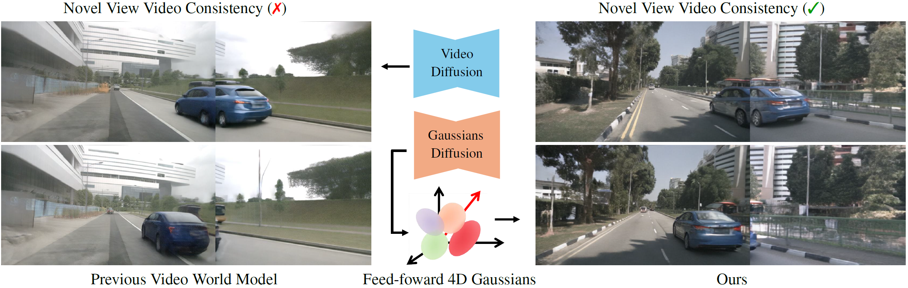

# [ICLR 2026] WorldSplat: Gaussian-Centric Feed-Forward 4D Scene Generation for Autonomous Driving

<p align="center">
  
</p>

> [Project Page](https://wm-research.github.io/worldsplat) | [arXiv](https://www.arxiv.org/abs/2509.23402)

WorldSplat is a **feed-forward 4D scene generation framework** designed for autonomous driving.
It introduces a **Gaussian-centric representation** that directly produces controllable 4D Gaussians from multi-modal latent diffusion features, enabling **spatially and temporally consistent novel-view driving videos** under user-defined trajectory shifts.

---

## Highlights

- **4D-aware Latent Diffusion** — Integrates RGB, depth, and semantic information to create a unified multi-modal latent space.
- **Feed-forward Gaussian Decoder** — Predicts pixel-aligned 3D Gaussians and performs dynamic-static decomposition to construct controllable 4D scenes.
- **High-fidelity Novel View Rendering** — Generates multi-track driving videos with improved temporal consistency via an enhanced diffusion refinement stage.
- **Downstream Benefits** — The generated data improves perception tasks such as 3D object detection and BEV map segmentation.

---

## News

`[2026/03]` Code and models released!

`[2026/01/26]` WorldSplat is accepted by ICLR 2026!

`[2025/05/09]` [ArXiv](https://www.arxiv.org/abs/2509.23402) paper release.

---

## Updates
- [x] Release Paper
- [x] Release Full Models
- [x] Release Inference Framework
- [x] Release Training Framework

---

## Installation

### Requirements
- Python >= 3.10
- PyTorch >= 2.1.0
- CUDA >= 11.8

### Setup

```bash
# Clone the repository
git clone https://github.com/wm-research/worldsplat.git
cd worldsplat

# Create conda environment
conda create -n worldsplat python=3.10 -y
conda activate worldsplat

# Install PyTorch (adjust for your CUDA version)
pip install torch==2.2.0 torchvision==0.17.0 --index-url https://download.pytorch.org/whl/cu118

# Install dependencies
pip install -r requirements.txt

# Install WorldSplat
pip install -e .

# Install gsplat (required for GS Decoder)
pip install gsplat
```

### Pre-trained Models

Download the following pre-trained models:

| Component | Description | Link |
|-----------|-------------|------|
| OpenSora-VAE-v1.2 | Video VAE backbone | [HuggingFace](https://huggingface.co/hpcai-tech/OpenSora-VAE-v1.2) |
| T5-v1.1-XXL | Text encoder | [HuggingFace](https://huggingface.co/google/t5-v1_1-xxl) |
| SD-VAE-ft-ema | Image VAE for GS Decoder | [HuggingFace](https://huggingface.co/stabilityai/sd-vae-ft-ema) |
| WorldSplat Checkpoints | All stage checkpoints | Coming soon |

---

## Data Preparation

We use the [nuScenes](https://www.nuscenes.org/) dataset. Follow these steps:

1. Download the nuScenes v1.0 dataset (trainval split).

2. Prepare the annotation JSON files upsampled to 12Hz following [StreamPETR](https://github.com/exiawsh/StreamPETR).

3. Generate auxiliary data:
   - **Depth maps**: Use [Metric3D v2](https://github.com/YvanYin/Metric3D) to generate per-view monocular depth maps (PNG format).
   - **Segmentation masks**: Use [SegFormer](https://github.com/NVlabs/SegFormer) to generate per-view dynamic/static segmentation masks.
   - **Road sketches**: Extract per-view road structure images from BEV annotations. These serve as the layout condition for the ControlNet branch.
   - **Scene captions**: Generate per-scene text descriptions using a VLM (e.g., Qwen2-VL). Pre-extract T5 caption features (`caption_feature` and `attn_mask` as `.npy` files) for training efficiency.

4. Organize the data directory as follows:
   ```
   data/
   └── nuscenes/
       ├── samples/                          # Original nuScenes images
       ├── sweeps/                           # Original nuScenes sweeps
       ├── v1.0-trainval/                    # Original nuScenes annotations
       ├── json/
       │   ├── nuscenes_workshop_train_seq.json   # 12Hz train annotations
       │   └── nuscenes_workshop_val_seq.json     # 12Hz val annotations
       ├── cam_road_sketch/                  # Road sketch condition images
       │   └── <token>_<camera>.png
       ├── scene_caption/                    # Pre-extracted T5 caption features
       │   ├── train/
       │   │   ├── caption_feature/          # .npy files per sample token
       │   │   └── attn_mask/               # .npy files per sample token
       │   └── val/
       │       ├── caption_feature/
       │       └── attn_mask/
       ├── depth_metric3d_v2_png/            # Monocular depth maps (PNG)
       │   └── <token>_<camera>.png
       └── seg_mask/                         # Dynamic/static segmentation masks
           └── <token>_<camera>.png
   ```

---

## Training

WorldSplat training consists of three independent stages.

### Stage 1: 4D-Aware Diffusion Model

Trains the multi-modal latent diffusion model that generates RGB + Depth + Segmentation latents.

```bash
bash scripts/train_stage1.sh
```

<details>
<summary>Training details</summary>

- Built on OpenSora v1.2 with ControlNet architecture
- Uses Rectified Flow scheduler
- 4 training phases: layout control (60K) -> mixed resolution (40K) -> rectified flow (20K) -> high-res fine-tuning (60K)
- 32x H20 GPUs, ~157 hours total

</details>

### Stage 2: Enhanced Diffusion Model

Trains the refinement model that improves novel-view renderings.

```bash
bash scripts/train_stage2.sh
```

<details>
<summary>Training details</summary>

- Same architecture as Stage 1, different input/output channels
- Uses mixed-conditioning strategy (degraded + high-quality views)
- 32x H20 GPUs, ~59 hours (50K iterations)

</details>

### Stage 3: Gaussian Decoder

Trains the feed-forward latent Gaussian decoder.

```bash
bash scripts/train_gs_decoder.sh
```

<details>
<summary>Training details</summary>

- Transformer-based decoder with cross-view attention
- Predicts per-pixel 3D Gaussians (14D parameters + segmentation logits)
- Multi-task loss: RGB reconstruction + perceptual + depth + segmentation
- 32x H20 GPUs, ~22 hours (100K iterations)

</details>

---

## Inference

Run the full three-stage inference pipeline:

```bash
python tools/inference.py \
    --config_stage1 configs/diffusion_4d_aware.yaml \
    --config_stage2 configs/diffusion_enhanced.yaml \
    --ckpt_stage1 /path/to/stage1_checkpoint.pt \
    --ckpt_stage2 /path/to/stage2_checkpoint.pt \
    --ckpt_gs_decoder /path/to/gs_decoder_checkpoint.pt \
    --vae_pretrained /path/to/OpenSora-VAE-v1.2 \
    --data_json data/nuscenes/json/nuscenes_workshop_val_seq.json \
    --output_dir outputs/ \
    --shift_meters 2.0
```

This will:
1. Generate multi-modal latents from control conditions
2. Decode latents into 4D Gaussians
3. Render novel-view videos along shifted ego trajectories
4. Refine renderings with the enhanced diffusion model

---

## Project Structure

```
worldsplat/
├── configs/                        # Training configurations
│   ├── diffusion_4d_aware.yaml     # Stage 1: 4D-Aware Diffusion
│   ├── diffusion_enhanced.yaml     # Stage 2: Enhanced Diffusion
│   └── gs_decoder.py               # Stage 3: Gaussian Decoder
├── worldsplat/
│   ├── diffusion/                  # Diffusion model modules
│   │   ├── stdit2.py               # STDiT2 backbone (unified)
│   │   ├── stdit2_blocks.py        # Shared building blocks
│   │   ├── controlnet.py           # ControlNet wrapper
│   │   ├── grounding_net.py        # Box/heading/instanceID grounding
│   │   ├── rflow.py                # Rectified Flow scheduler
│   │   ├── iddpm.py                # IDDPM sampler
│   │   ├── vae.py                  # Video VAE wrapper
│   │   └── mask_generator.py       # Frame masking
│   ├── gs_decoder/                 # Gaussian Decoder modules
│   │   ├── model.py                # LatentGaussianDecoder
│   │   ├── gaussian_renderer.py    # Gaussian splatting renderer
│   │   ├── pixel_decoder.py        # Per-pixel Gaussian prediction
│   │   ├── gs_head.py              # Decoder head
│   │   └── losses.py               # Training losses
│   ├── data/                       # Dataset and dataloaders
│   └── utils/                      # Training utilities
├── tools/                          # Training and inference scripts
│   ├── train_diffusion.py          # Unified diffusion trainer
│   ├── train_gs_decoder.py         # GS Decoder trainer
│   └── inference.py                # Full inference pipeline
└── scripts/                        # Shell scripts
```

---

## Acknowledgements

This project builds upon the following excellent works:

- [OpenSora](https://github.com/hpcaitech/Open-Sora) — Video generation backbone
- [MagicDrive](https://github.com/cure-lab/MagicDrive) — Multi-view control conditions
- [3D Gaussian Splatting](https://github.com/graphdeco-inria/gaussian-splatting) — Gaussian rasterization
- [OmniScene](https://github.com/OmniScene/OmniScene) — Feed-forward Gaussian reconstruction
- [ColossalAI](https://github.com/hpcaitech/ColossalAI) — Distributed training framework

---

## Citation

If you find this work useful, please cite:

```bibtex
@inproceedings{zhu2026worldsplat,
      title={WorldSplat: Gaussian-Centric Feed-Forward 4D Scene Generation for Autonomous Driving},
      author={Ziyue Zhu and Zhanqian Wu and Zhenxin Zhu and Lijun Zhou and Haiyang Sun and Bing Wang and Kun Ma and Guang Chen and Hangjun Ye and Jin Xie and Jian Yang},
      booktitle={International Conference on Learning Representations (ICLR)},
      year={2026}
}
```

---

## License

This project is released under the [Apache 2.0 License](LICENSE).
